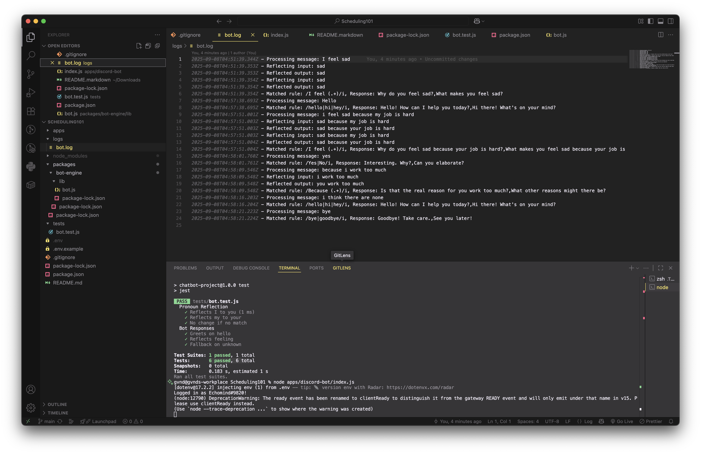

# EchoMind, a Rule-Based Chatbot with Pronoun Reflection

Chatbot sederhana berbasis aturan (regex) yang merefleksikan kata ganti untuk simulasi percakapan terapeutik, terintegrasi dengan Discord.

## Latar Belakang
Chatbot ini dikembangkan untuk membantu individu mengatasi kesulitan komunikasi interpersonal, terutama yang mengalami kecemasan sosial atau ingin refleksi diri. Menggunakan pendekatan berbasis aturan seperti ELIZA, bot ini memantulkan kata ganti (misalnya, "I feel sad" menjadi "Why do you feel sad?") untuk simulasi terapeutik sederhana, terintegrasi ke Discord untuk akses mudah.

## Setup & Run

### Prasyarat
- Node.js v18+.
- Buat bot Discord di [Discord Developer Portal](https://discord.com/developers/applications), dapatkan token, dan tambahkan bot ke server kamu.

### Install Dependencies
Di root project:
```
npm install
```
Pastikan `package.json` memiliki: `"dependencies": {"discord.js": "^14.15.3", "dotenv": "^16.4.5"}`.

### Konfigurasi
- Copy `.env.example` menjadi `.env`.
- Isi `DISCORD_TOKEN` dengan token bot Discord kamu.

### Run untuk CLI (Testing Core Bot)
Untuk test core bot:
```
node packages/bot-engine/lib/bot.js
```
(Note: File ini bukan executable langsung; gunakan tests untuk evaluasi penuh.)

### Run untuk Integrasi Discord
Di root project:
```
node apps/discord-bot/index.js
```

Kemudian, akses [link](https://discord.com/oauth2/authorize?client_id=1413427196151988285&permissions=67584&integration_type=0&scope=bot) ini untuk menambahkan bot pada server yang anda inginkan
Bot akan aktif di Discord. Kemudian, gunakan prefix `!chat` (misalnya: `!chat I feel sad`) untuk trigger percakapan yang anda inginkan.

## Contoh Pengunaan dan Demo
Watch EchoMind in action!

Contoh percakapan di Discord:
- User: `!chat Hello` → Bot: `Hi there! What's on your mind?`
- User: `!chat I feel sad because my job is hard` → Bot: `Why do you feel sad because your job is hard?`


## Tests
Unit/functional tests ada di `tests/bot.test.js`. Install `jest` (`npm install --save-dev jest`) pada root folder dan jalankan:
```
npm test
```


